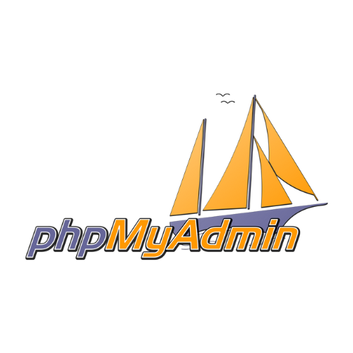

# A RAW - PHP REST API

> Under Development

<a href="https://www.php.net/" target="_blank"></a>
<a href="https://restfulapi.net/" target="_blank"></a>
<a href="https://www.litespeedtech.com/products/litespeed-web-server" target="_blank"></a>
<a href="https://www.phpmyadmin.net/" target="_blank"></a>
<a href="https://mariadb.com/" target="_blank"></a>

This was build to to support **Shared Hosting** on Hostinger.com. I tried using composer with packages like: `leafphp` or `slim php` on their shared hosting via SSH. While it did install it, sadly the routes has more issues than necessary. I get the feeling that litespeed server is not an appropriate replacement for apache. Therefore I saw the need to build a `raw php rest api` for my needs. - This could technically be adapted for a different structure.

## How to Run

1. Clone this repo
2. Setup your Docker environment with Docker Compose
3. Setup your MariaDB
4. Change your `.env.example` to `.env` and add your MariaDB credentials
5. Make sure Litespeed Web Server is running in Docker
6. Open a browser: `http://localhost/api/` - If everything is configured correctly you should see:

```json
{ "msg": "Connected" }
```

## Docker Compose

Make sure you clone the whole repo. This must include the `Dockerfile` and the `docker-compose.yml`

🏃‍➡️ Run Docker Compose in `detached-mode`.

```bash
docker compose up -d
```

(Mac) - Adjust this command for your operating system. Docker must be running. That means `Mac` and `Windows` users make sure you are running `Docker Desktop` in the background. Running this command will create a new docker service called "raw-php-api".

```txt
# Docker Structure

|__ raw-php-api
    |__ openlitespeed-server
    |__ phpmyadmin
    |__ mariadb
```

## Containers

<a href="https://www.litespeedtech.com/products/litespeed-web-server" target="_blank"></a>

### OpenLiteSpeed

This is a server that is used by the hosting company `Hostinger.com` on their Shared Hosting. It is a variance of Apache. It is faster and has less dependencies than Apache.

<a href="https://www.phpmyadmin.net/" target="_blank"></a>

### phpMyAdmin

This is a backend admin console for interacting with `MySQL` databases. This also works with `MariaDB` because it is a variance adapted from MySQL.

<a href="https://mariadb.com/" target="_blank"></a>

### MariaDB

MariaDB is an open-source relational database management system (RDBMS) that is a fork of MySQL, created by the original developers of MySQL due to concerns about Oracle's acquisition of the project. It offers improved performance, enhanced security, and better scalability than MySQL.

## File structure

```
└── api/
    ├── htaccess
    ├── .env
    ├── Database.php
    ├── index.php
    └── src/
        ├── Controllers/
        │   └── RoleControllers.php
        └── Routes/
            └── RoleRoutes.php
```

## Database

This is currently uses a `MariaDB` part of the Shared Hosting service. You will need to configure the database yourself. Rename `.env.example` to `.env` - You'll notice there is commented out `Production` section. This is for your live environment. To build this, I utilized Docker which is why the: **DB_HOST** is set to `mariadb`. However, for the production, I will comment out the Development and uncomment the Production along with supplying the correct address for the database. And of course providing the values for the other values.

🗄️ To build the basic structure of the database. Please use the `db-model/schema.sql` file. The easiest way to accomplish this is by running the `sql query` for each model separately in `phpMyAdmin`.

## Environment Variables (.env)

▶️ **Development** this is set to `mariadb` to reference the Docker Container. Otherwise you might not be able to connect, since you are not running the api directly in docker.

```yaml
# .env.example
# # Production
# DB_HOST=XXX.XXX.XXX.XXX

# Development
DB_HOST=mariadb

# Common
DB_NAME=
DB_USER=
DB_PASS=
```

## .htaccess

To secure the .env file I had to create a .htaccess file. Here is the configuration for it.

```ruby
RewriteEngine On

# Block access to .env file
<Files ".env">
    Require all denied
</Files>

# Send all requests to index.php
RewriteCond %{REQUEST_FILENAME} !-f
RewriteCond %{REQUEST_FILENAME} !-d
RewriteRule ^(.*)$ index.php [QSA,L]
```
